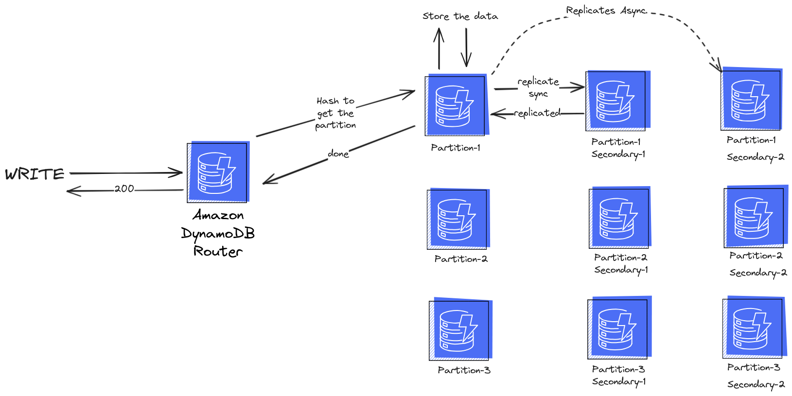

# GoPay
GoPay is a C2C platform that provides a seamless experience to buyers and sellers.

# Backend Technologies
## Databases : 
- DynamoDB
    - So far we don't know exaclty the schema of the data models.
    - I need strong consistency and Dynamodb has 2 types of consistency : 
        - Eventually Consistent (The Default) and it gives us the latest written data after max 1-sec, but we might read some stale data if we read from the secondary-partition that replicates the data asynchronously.
        - Strong Consistency, where we will always get the latest data when we read after write
        
    - It works very well with Lambda and almost all endpoints will be lambda functions because the entire backend will be serverless on AWS.